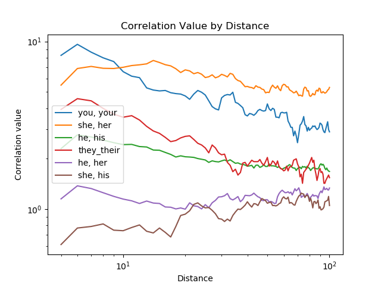

# Long-range Word Dependency

 
This repo contains code to implement correlation function to analyze word dependencies
in an English corpus. 

To run the code 

`python correlation_function.py`

The program will produce the following plots 

**Correlation values in a linear scale**

**Correlation values with the x-axis in a logarithmic scale and the y-axis in a linear
scale** 

 
